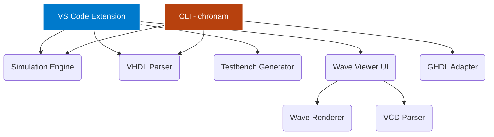

<div align="center">
  <br />
  
  <h1>Chronam</h1>
  <p><strong>The Modern VHDL Development Environment</strong></p>

  <p>
    <a href="https://github.com/Nciibi/chronam/actions"></a>
    <a href="https://github.com/Nciibi/chronam/blob/main/LICENSE"></a>
    <a href="https://marketplace.visualstudio.com/items?itemName=Nciibi.chronam"></a>
    <a href="https://crates.io/crates/chronam"></a>
    <a href="https://github.com/Nciibi/chronam"></a>
  </p>
  <br />
</div>

**Chronam** is a high-performance, cross-platform VHDL development environment. It pairs a
**VS Code extension** for interactive editing and waveform viewing with a **standalone Rust CLI**
for build automation, simulation, and CI/CD — all powered by [GHDL](https://ghdl.github.io/ghdl/).

Write VHDL, run a simulation, and inspect the resulting waveforms natively in your terminal or editor —
no external viewers, no block-art hacks, no synthetic data.

---

## ✨ Features

### VS Code Extension
- 🚀 **One-Click Simulation** — `▶ Run Simulation` compiles, elaborates, and simulates through GHDL.
- ⚡ **Lightning-Fast Wave Viewer** — a custom HTML5 Canvas 2D renderer handles 1,000+ signals with zero lag, adaptive zoom/pan, and cursor measurements.
- 🧠 **Smart Entity Detection** — extracts entities, ports, architectures, and internal signals on the fly.
- 📝 **Auto-Testbench Generation** — select an entity and Chronam writes the clock/reset stimulus boilerplate.
- 🛡️ **Human-Readable Errors** — cryptic GHDL `stderr` output is translated into inline Diagnostics.

### CLI (`chronam`)
A professional Rust CLI for headless automation and interactive waveform viewing:
- 🔧 **Testbench Scaffolding** — generate a build-ready testbench from any entity in one command.
- 🏃 **End-to-End Simulation** — `analyze → elaborate → run → view`, in a single call.
- 📈 **Terminal Wave Viewer (TUI)** — a medical-monitor-style waveform browser rendered with [ratatui](https://ratatui.rs/).
- 🧪 **Built-in Demo** — launch a synthetic heart-monitor waveform with `wave --mock`.
- 🤖 **CI-Ready** — `build`, `test`, `lint`, `simulate`, and `watch` for pipelines.

---

## 🚀 Quick Start

### 1. Prerequisites
- **Rust 1.81+** — install from [rustup.rs](https://rustup.rs).
- **GHDL** on your `PATH` (or set `GHDL_PATH`). Download from [ghdl.github.io](https://ghdl.github.io/ghdl/).
- *(VS Code extension only)* Visual Studio Code.

Verify your toolchain:
```bash
cargo --version
ghdl --version
```

### 2. Build from source

```bash
git clone https://github.com/Nciibi/chronam.git
cd chronam
```

Then build the CLI:

```bash
# From the repository root
cargo build --manifest-path packages/cli/Cargo.toml

# …or step into the package first
cd packages/cli
cargo build
```

The binary is produced at:

| Profile | Path |
|---------|------|
| Debug   | `packages/cli/target/debug/chronam[.exe]` |
| Release | `packages/cli/target/release/chronam[.exe]` |

> 💡 For daily use, build once with `cargo build --release` (or `cargo install --path packages/cli`)
> and run `chronam` from anywhere. The examples below use the **full binary path** so they work
> without adding anything to `PATH`.

### 3. Run your first simulation

From the **repository root**, run the bundled demo testbench:

```bash
# Windows
D:\projects\chronam\packages\cli\target\debug\chronam.exe --run-sim demo_sim/testbench_demo.vhdl

# macOS / Linux
./packages/cli/target/debug/chronam --run-sim demo_sim/testbench_demo.vhdl
```

Or with your own design — generate a testbench, add stimulus, then simulate:

```bash
cd <your code directory>

# 1. Generate a testbench skeleton in <entity>_sim/
D:\projects\chronam\packages\cli\target\debug\chronam.exe my_design.vhdl
#   → creates my_design_sim/testbench_my_design.vhdl

# 2. Edit the testbench to add your stimulus, then:
D:\projects\chronam\packages\cli\target\debug\chronam.exe --run-sim my_design_sim/testbench_my_design.vhdl
```

This command:
1. Cleans any stale GHDL work library.
2. Analyzes **all** VHDL sources (design under test **before** the testbench).
3. Elaborates the testbench entity.
4. Runs the GHDL simulation and writes a VCD.
5. Launches the interactive terminal wave viewer with the real captured data.

Press `Space` to pause/resume, arrow keys to navigate, and `q` to quit.

---

## 📦 Command Reference

| Command / Flag | Description |
|---------|-------------|
| `chronam <file>.vhdl` | Generate a testbench skeleton in `<entity>_sim/` |
| `chronam --run-sim <testbench>` | Analyze, elaborate, simulate via GHDL, then launch the TUI wave viewer |
| `chronam wave [VCD_PATH]` | Open an existing VCD file in the TUI viewer |
| `chronam wave --mock` | Launch the built-in hospital heart-monitor demo |
| `chronam simulate <entity>` | Run a simulation and export waveforms |
| `chronam new` | Scaffold a new VHDL project |
| `chronam build` | Compile and elaborate all sources |
| `chronam test` | Auto-discover and run testbenches |
| `chronam lint` | Syntax-check all source files |
| `chronam compile` | Compile individual files |
| `chronam clean` | Remove build artifacts |
| `chronam doctor` | Diagnose the environment (GHDL, Git, etc.) |
| `chronam watch` | Rebuild on file changes |
| `chronam info` | Show project metadata |
| `chronam completion` | Generate shell completions |

### TUI Wave Viewer Controls

| Key | Action |
|-----|--------|
| `Space` | Pause / resume the sweep |
| `↑` / `↓` | Select signal |
| `+` / `-` | Increase / decrease playback speed |
| `z` / `x` | Zoom in / out (time per character) |
| `←` / `→` | Move the measurement cursor |
| `h` | Toggle the help bar |
| `q` / `Esc` / `Ctrl+C` | Quit |

The viewer renders every signal as a continuous thin-line trace (medical-monitor style) with its
label aligned to its own band. Real VCD data from GHDL is displayed through `VcdSource` — no
synthetic data. Signals that are **undefined** (`U`/`X`/`Z`) in the simulation are shown as a
distinct orange dashed line so you can see the band exists but was never driven.

---

## 🩺 Troubleshooting

**`ghdl: command not found`**
Install GHDL and ensure it is on your `PATH`, or point Chronam at it:
```bash
export GHDL_PATH=/usr/local/bin/ghdl     # macOS / Linux
set GHDL_PATH=D:\ghdl\bin\ghdl.exe        # Windows (PowerShell)
```

**`architecture "sim" of "…" is obsoleted by entity "…"`**
A stale GHDL work library (`.cf` files) from a previous run is conflicting with the current
sources. `chronam --run-sim` cleans the work library automatically; if you run GHDL manually,
delete `work-obj*.cf` in the working directory and re-analyze.

**`unit "demo" not found in library "work"`**
The design under test was analyzed *after* the testbench that instantiates it. Chronam orders
sources so the DUT is analyzed first; when invoking GHDL directly, analyze the DUT file before
the testbench.

**A signal shows only an orange dashed line (or nothing)**
That signal is `U`/`X`/`Z` for the entire simulation — it was never driven. Add stimulus in the
testbench, or implement the output in the design under test. The viewer is showing the truthful
state of the VCD; there is no waveform data to draw.

**The viewer feels slow on large VCDs**
VCD lookup is `O(log n)` per cell via a binary search over pre-sorted transitions, so it scales to
large captures. FPS is shown live in the status bar; if it is low, the terminal itself may be the
bottleneck (a very large window width on a slow terminal).

---

## 🏗️ Architecture

Chronam is a monorepo managed by Turborepo with two language runtimes:



| Package | Type | Description |
|---|---|---|
| `chronam` (root) | Extension | VS Code extension entry point |
| `packages/core` | TS | Editor-agnostic orchestration layer |
| `packages/simulation-engine` | TS | GHDL adapter and simulation orchestration |
| `packages/vcd-parser` | TS | IEEE 1364 VCD tokenizer and parser |
| `packages/vhdl-parser` | TS | Entity, port, and architecture extraction |
| `packages/testbench-generator` | TS | VHDL testbench scaffolding |
| `packages/wave-renderer` | TS | HTML Canvas 2D waveform engine |
| `packages/wave-viewer` | TS/React | Webview-based waveform UI |
| `packages/shared-types` | TS | IPC protocol interfaces |
| `packages/cli` | Rust | Standalone VHDL development CLI |

---

## 🗺️ Roadmap

| Phase | Milestone | Status |
|:---:|---|---|
| **v0.1** | Core pipeline, VCD parsing, GHDL adapter, Canvas Wave Viewer | 🟢 Done |
| **v0.2** | Interactive UI controls, signal grouping, radix switching | 🟡 Active |
| **v0.3** | Rust CLI GA, waveform renderer redesign, CI/CD integration | 🟡 Active |
| **v0.4** | FSM visualization, timing violation cursors | ⚪ Planned |
| **v0.5** | AI-assisted debugging, ModelSim/Verilator adapters | ⚪ Future |

---

## 🤝 Contributing

We welcome contributions of all kinds — bug reports, feature requests, or pull requests.

1. Fork the repository.
2. Set up the development environment (see below).
3. Pick an issue from the [tracker](https://github.com/Nciibi/chronam/issues).
4. Follow [CONTRIBUTING.md](CONTRIBUTING.md).
5. Submit a pull request.

### Development Setup

```bash
git clone https://github.com/Nciibi/chronam.git
cd chronam

# Install JS dependencies (requires pnpm)
pnpm install

# Build all monorepo packages
pnpm build

# Build the Rust CLI
cargo build --manifest-path packages/cli/Cargo.toml

# Open the extension in VS Code (press F5 for the Extension Development Host)
code .
```

### What We Need Help With
- **Rust CLI** — new commands, GHDL edge cases, cross-platform testing.
- **Waveform Viewer** — UI polish, performance, signal grouping, radix display.
- **VHDL Parser** — support for more VHDL-2008 constructs.
- **Documentation** — tutorials, API docs, example projects.
- **Testing** — integration tests for the simulation pipeline.

---

## 📄 License

Copyright © 2024 The Chronam Contributors

Licensed under the **MIT License** (the "License");
you may not use this file except in compliance with the License.
You may obtain a copy of the License at:

<https://opensource.org/licenses/MIT>

Unless required by applicable law or agreed to in writing, software
distributed under the License is distributed on an **"AS IS" BASIS,
WITHOUT WARRANTIES OR CONDITIONS OF ANY KIND**, either express or implied.
See the License for the specific language governing permissions and
limitations under the License.

The full license text is available in the [LICENSE](LICENSE) file.

---

<div align="center">
  <sub>Built with ❤️ by <a href="https://github.com/Nciibi">Nciibi</a> and <a href="https://github.com/Nciibi/chronam/graphs/contributors">contributors</a>.</sub>
</div>
