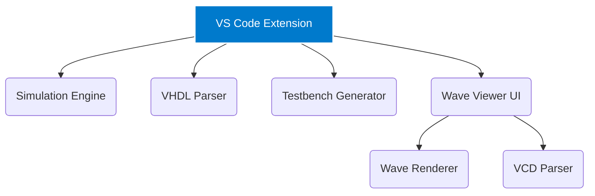

<div align="center">
  <br />
  
  <h1>Chronam</h1>
  <p><strong>The Modern VHDL Development Environment for VS Code</strong></p>
  
  <p>
    <a href="https://github.com/Nciibi/chronam/actions"></a>
    <a href="https://github.com/Nciibi/chronam/blob/main/LICENSE"></a>
    <a href="https://marketplace.visualstudio.com/items?itemName=Nciibi.chronam"></a>
    <a href="https://github.com/Nciibi/chronam"></a>
    <a href="https://github.com/Nciibi/chronam"></a>
  </p>                    
  <br />                   
</div>

**Chronam** is a high-performance, cross-platform extension for Visual Studio Code designed to replace the fragmented, painful UX of legacy HDL tools. It brings parsing, compiling, simulating, and a blazing fast hardware-accelerated waveform viewer directly into your favorite editor.

Write VHDL, press Run, and analyze the waveforms natively in VS Code.

---

## ✨ Features

- 🚀 **One-Click Simulation** — Hit `▶ Run Simulation` to seamlessly compile, elaborate, and simulate via GHDL.
- ⚡ **Lightning-Fast Wave Viewer** — Custom HTML5 Canvas 2D waveform renderer handles 1,000+ signals with zero lag. Includes adaptive zoom, pan, and cursor measurements.
- 🧠 **Smart Entity Detection** — Regex-based parser detects entities, ports, architectures, and internal signals on the fly.
- 📝 **Auto-Testbench Generation** — Select an entity, and Chronam writes the boilerplate. Automatically detects clock/reset signals and binds them to auto-generated stimulus processes.
- 🛡️ **Human-Readable Errors** — Cryptic `stderr` simulator outputs are intercepted and translated into inline VS Code Diagnostics and error overlays.
- 🧩 **Modular Architecture** — Built on a Turborepo foundation, decoupling the simulation orchestration, parsers, and renderer for ultimate extensibility.

## 🚀 Getting Started

### Prerequisites

1. **Visual Studio Code** (v1.85.0 or newer)
2. **GHDL** (must be installed and available on your system `PATH`)
   - **Windows:** Download from the [GHDL Releases page](https://github.com/ghdl/ghdl/releases).
   - **Linux:** Run `sudo apt install ghdl` or build from source.
   - **macOS:** Install via Homebrew `brew install ghdl`.

### Installation for Developers

To run and modify Chronam locally:

```bash
# 1. Clone the repository
git clone https://github.com/Nciibi/chronam.git
cd chronam

# 2. Install dependencies (Requires pnpm)
pnpm install

# 3. Build the monorepo packages
pnpm build

# 4. Open the extension in VS Code
code apps/vscode-extension
```

*Press `F5` in the VS Code window to launch the Extension Development Host.*

## 📖 Usage Workflow

1. Open any `.vhd` or `.vhdl` file in VS Code.
2. Chronam will parse the file and inject a **CodeLens** directly above your entity declaration.
3. Click **▶ Run Simulation** to execute the flow.
4. If no testbench exists, click **📝 Generate Testbench** to scaffold one instantly.
5. Once simulation completes, the **Chronam Wave Viewer** will open automatically as a split panel displaying the generated VCD file.

## 🏗️ Architecture

Chronam is built as a highly modular `pnpm` workspace orchestrated by Turborepo:



| Package | Description |
|---|---|
| `apps/vscode-extension` | The VS Code entry point, commands, and CodeLens providers. |
| `packages/simulation-engine` | Orchestrator and CLI adapter for backend simulators (GHDL). |
| `packages/vcd-parser` | Single-pass IEEE 1364 VCD file tokenizer and parser. |
| `packages/vhdl-parser` | Syntax extractor for entities, ports, and architectures. |
| `packages/testbench-generator` | Boilerplate VHDL code generation and stimulus mapping. |
| `packages/wave-renderer` | High-performance HTML Canvas 2D drawing engine. |
| `packages/shared-types` | Strictly typed interfaces governing the IPC protocols. |

## 🗺️ Roadmap

| Phase | Milestone | Status |
|:---:|---|:---:|
| **v0.1** | Core pipeline, VCD parsing, GHDL adapter, Canvas Wave Viewer | 🟢 Done |
| **v0.2** | Interactive UI controls, signal grouping, radix switching (Hex/Dec/Bin) | 🟡 Active |
| **v0.3** | Automated FSM visualization, timing violation cursors | ⚪ Planned |
| **v0.4** | AI-assisted debugging, generic Simulator Adapter (ModelSim/Verilator) | ⚪ Future |

## 🤝 Contributing

We welcome contributions from the community! Please read our [Contributing Guidelines](CONTRIBUTING.md) for details on our code of conduct, development process, and how to submit pull requests.

## 📄 License

This project is licensed under the MIT License — see the [LICENSE](LICENSE) file for details.

---
<div align="center">
  <sub>Built with ❤️ by <a href="https://github.com/Nciibi">Nciibi</a> and contributors.</sub>
</div>
