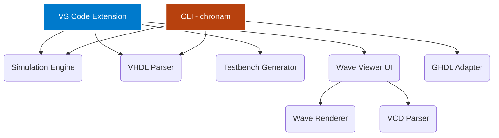

<div align="center">
  <br />
  
  <h1>Chronam</h1>
  <p><strong>The Modern VHDL Development Environment</strong></p>

  <p>
    <a href="https://github.com/Nciibi/chronam/actions"></a>
    <a href="https://github.com/Nciibi/chronam/blob/main/LICENSE"></a>
    <a href="https://marketplace.visualstudio.com/items?itemName=Nciibi.chronam"></a>
    <a href="https://crates.io/crates/chronam"></a>
    <a href="https://github.com/Nciibi/chronam"></a>
  </p>
  <br />
</div>

Chronam is a high-performance, cross-platform VHDL development environment. It combines a **VS Code extension** for interactive editing and waveform viewing with a **standalone Rust CLI** for build automation and CI/CD pipelines — all powered by GHDL.

Write VHDL, press Run, and analyze the waveforms natively in VS Code — or run `chronam build` in your terminal.

---

## 📦 Products

### VS Code Extension

- 🚀 **One-Click Simulation** — Hit `▶ Run Simulation` to compile, elaborate, and simulate via GHDL.
- ⚡ **Lightning-Fast Wave Viewer** — Custom HTML5 Canvas 2D waveform renderer handles 1,000+ signals with zero lag. Adaptive zoom, pan, and cursor measurements.
- 🧠 **Smart Entity Detection** — Regex-based parser extracts entities, ports, architectures, and internal signals on the fly.
- 📝 **Auto-Testbench Generation** — Select an entity, and Chronam writes the boilerplate with clock/reset stimulus.
- 🛡️ **Human-Readable Errors** — Cryptic GHDL `stderr` output is translated into inline VS Code Diagnostics.

### CLI (`chronam`)

A professional Rust CLI for headless build automation, CI/CD, simulation, and interactive waveform viewing:

#### Quick Workflow

```bash
# Generate a testbench from your VHDL design
chronam counter.vhdl

# Edit the generated testbench (counter_sim/testbench_counter.vhdl),
# then run simulation + TUI wave viewer:
chronam --run-sim counter_sim/testbench_counter.vhdl
```

#### Commands

| Command / Flag | Description |
|---------|-------------|
| `chronam <file>.vhdl` | Generate a testbench skeleton in `<entity>_sim/` |
| `chronam --run-sim <testbench>` | Run GHDL simulation then launch TUI wave viewer |
| `chronam wave [VCD_PATH]` | Open a VCD file in the TUI viewer |
| `chronam wave --mock` | Launch built-in hospital heart-monitor demo |
| `chronam simulate <entity>` | Run simulation and export waveforms |
| `chronam new`    | Scaffold a new VHDL project |
| `chronam build`  | Compile and elaborate all sources |
| `chronam test`   | Auto-discover and run testbenches |
| `chronam lint`   | Syntax-check all source files |
| `chronam compile` | Compile individual files |
| `chronam clean`  | Remove build artifacts |
| `chronam doctor` | Diagnose environment (GHDL, Git, etc.) |
| `chronam watch`  | Rebuild on file changes |
| `chronam info`   | Show project metadata |
| `chronam completion` | Generate shell completions |

#### TUI Wave Viewer Controls

| Key | Action |
|-----|--------|
| `Space` | Pause / resume simulation |
| `↑` / `↓` | Select signal |
| `+` / `-` | Increase / decrease speed |
| `z` / `x` | Zoom in / out |
| `←` / `→` | Move cursor |
| `h` | Toggle help |
| `q` / `Esc` / `Ctrl+C` | Quit |

The viewer renders all signals as continuous thin-line traces (medical monitor style)
with a persistent bottom command bar. Real VCD data from GHDL is displayed via
`VcdSource` — no synthetic data, no block characters.

All commands feature colored output, rich tables, progress bars, and actionable error messages.

## 🚀 Getting Started

### VS Code Extension

1. Install **GHDL** and add it to your `PATH`.
2. Install **Chronam** from the [VS Code Marketplace](https://marketplace.visualstudio.com/items?itemName=Nciibi.chronam).
3. Open any `.vhd` or `.vhdl` file — CodeLens buttons appear above each entity.

### CLI

```bash
# Install via Cargo (requires Rust 1.81+)
cargo install chronam

# Or build from source
git clone https://github.com/Nciibi/chronam.git
cd chronam/packages/cli
cargo build --release
./target/release/chronam --help
```

### Development Setup

```bash
# Clone the repository
git clone https://github.com/Nciibi/chronam.git
cd chronam

# Install JS dependencies (requires pnpm)
pnpm install

# Build all monorepo packages
pnpm build

# Build the Rust CLI separately
cargo build --manifest-path packages/cli/Cargo.toml

# Open the extension in VS Code
code .
```

*Press `F5` in VS Code to launch the Extension Development Host.*

## 📖 Usage Workflow

1. Open any `.vhd` or `.vhdl` file in VS Code.
2. Click **▶ Run Simulation** (injected as CodeLens above entities).
3. No testbench? Click **📝 Generate Testbench** to scaffold one.
4. View waveforms in the built-in **Chronam Wave Viewer**.
5. For CI/CD, run `chronam build && chronam test` in your pipeline.

## 🏗️ Architecture

Chronam is a monorepo managed by Turborepo with two language runtimes:



| Package | Type | Description |
|---|---|---|
| `chronam` (root) | Extension | VS Code extension entry point |
| `packages/core` | TS | Editor-agnostic orchestration layer |
| `packages/simulation-engine` | TS | GHDL adapter and simulation orchestration |
| `packages/vcd-parser` | TS | IEEE 1364 VCD tokenizer and parser |
| `packages/vhdl-parser` | TS | Entity, port, and architecture extraction |
| `packages/testbench-generator` | TS | VHDL testbench scaffolding |
| `packages/wave-renderer` | TS | HTML Canvas 2D waveform engine |
| `packages/wave-viewer` | TS/React | Webview-based waveform UI |
| `packages/shared-types` | TS | IPC protocol interfaces |
| `packages/cli` | Rust | Standalone VHDL development CLI |

## 🗺️ Roadmap

| Phase | Milestone | Status |
|:---:|---|---|
| **v0.1** | Core pipeline, VCD parsing, GHDL adapter, Canvas Wave Viewer | 🟢 Done |
| **v0.2** | Interactive UI controls, signal grouping, radix switching | 🟡 Active |
| **v0.3** | Rust CLI GA, waveform renderer redesign, CI/CD integration | 🟡 Active |
| **v0.4** | FSM visualization, timing violation cursors | ⚪ Planned |
| **v0.5** | AI-assisted debugging, ModelSim/Verilator adapters | ⚪ Future |

## 🤝 Contributing

We welcome contributions of all kinds — whether it's a bug report, a feature request, or a pull request.

### Quick Start for Contributors

1. Fork the repository.
2. Set up the development environment (see [Getting Started](#development-setup)).
3. Pick an issue from the [tracker](https://github.com/Nciibi/chronam/issues).
4. Follow the [contribution guidelines](CONTRIBUTING.md).
5. Submit a pull request.

### What We Need Help With

- **Rust CLI** — New commands, GHDL edge cases, cross-platform testing.
- **Waveform Viewer** — UI polish, performance, signal grouping, radix display.
- **VHDL Parser** — Support for more VHDL-2008 constructs.
- **Documentation** — Tutorials, API docs, example projects.
- **Testing** — Integration tests for the simulation pipeline.

## 📄 License

Copyright © 2024 The Chronam Contributors

Licensed under the **MIT License** (the "License");
you may not use this file except in compliance with the License.
You may obtain a copy of the License at:

<https://opensource.org/licenses/MIT>

Unless required by applicable law or agreed to in writing, software
distributed under the License is distributed on an **"AS IS" BASIS,
WITHOUT WARRANTIES OR CONDITIONS OF ANY KIND**, either express or implied.
See the License for the specific language governing permissions and
limitations under the License.

The full license text is available in the [LICENSE](LICENSE) file.

---

<div align="center">
  <sub>Built with ❤️ by <a href="https://github.com/Nciibi">Nciibi</a> and <a href="https://github.com/Nciibi/chronam/graphs/contributors">contributors</a>.</sub>
</div>
