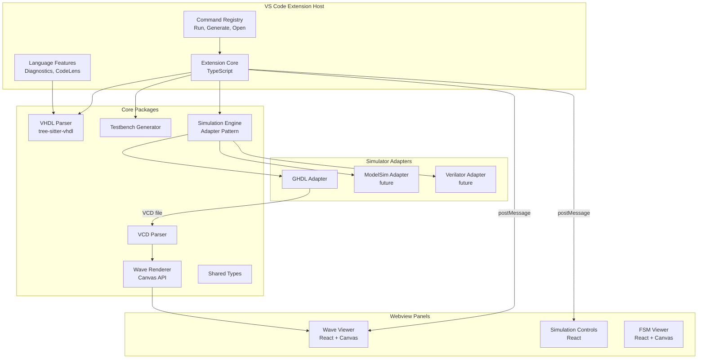
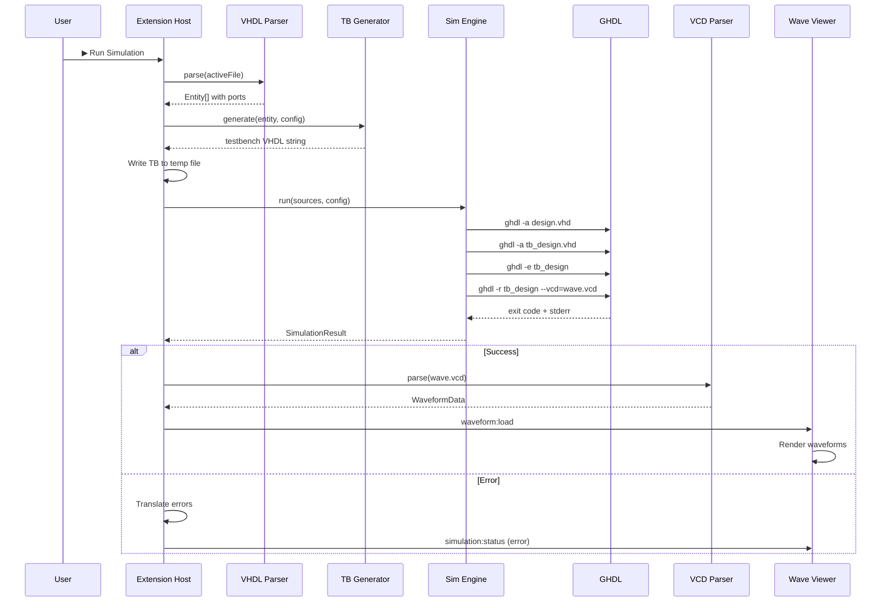

# WaveForge — Architecture & Implementation Plan

## 1. Vision

WaveForge is a modern, open-source VHDL development environment delivered as a VS Code extension. It replaces the fragmented, painful UX of legacy HDL tools (ModelSim, Vivado Simulator) with a unified, fast, visual experience inspired by Chrome DevTools and modern observability dashboards.

---

## 2. High-Level Architecture



---

## 3. Monorepo Structure

```
waveforge/
├── .vscode/                     # Workspace settings
├── apps/
│   └── vscode-extension/        # VS Code extension entry point
│       ├── src/
│       │   ├── extension.ts     # Activation, command registration
│       │   ├── commands/        # Command implementations
│       │   ├── providers/       # TreeView, CodeLens, Diagnostics
│       │   ├── webview/         # Webview panel management
│       │   ├── services/        # Orchestration layer
│       │   └── utils/
│       ├── package.json         # Extension manifest (contributes)
│       └── tsconfig.json
├── packages/
│   ├── core/                    # Core orchestration logic
│   │   └── src/
│   │       ├── project.ts       # Project model
│   │       ├── workspace.ts     # Multi-file workspace
│   │       └── config.ts        # User configuration
│   ├── vhdl-parser/             # VHDL parsing & entity extraction
│   │   └── src/
│   │       ├── parser.ts        # tree-sitter integration
│   │       ├── entity.ts        # Entity/port extraction
│   │       ├── architecture.ts  # Architecture body parsing
│   │       └── types.ts         # AST types
│   ├── testbench-generator/     # Automatic testbench generation
│   │   └── src/
│   │       ├── generator.ts     # TB generation engine
│   │       ├── templates/       # Process templates
│   │       ├── clock.ts         # Clock process generation
│   │       ├── stimulus.ts      # Stimulus generation
│   │       └── types.ts
│   ├── simulation-engine/       # Simulator orchestration
│   │   └── src/
│   │       ├── engine.ts        # Abstract engine interface
│   │       ├── adapters/
│   │       │   ├── ghdl.ts      # GHDL adapter
│   │       │   └── adapter.ts   # Base adapter interface
│   │       ├── runner.ts        # Process execution
│   │       ├── diagnostics.ts   # Error parsing & translation
│   │       └── types.ts
│   ├── vcd-parser/              # VCD file parser
│   │   └── src/
│   │       ├── parser.ts        # Streaming VCD parser
│   │       ├── tokenizer.ts     # VCD tokenizer
│   │       ├── model.ts         # In-memory signal model
│   │       └── types.ts
│   ├── wave-renderer/           # Waveform rendering engine
│   │   └── src/
│   │       ├── renderer.ts      # Canvas rendering pipeline
│   │       ├── layout.ts        # Signal layout manager
│   │       ├── viewport.ts      # Zoom/pan viewport
│   │       ├── cursor.ts        # Cursor & measurement
│   │       ├── themes.ts        # Color themes
│   │       └── types.ts
│   ├── wave-viewer/             # React webview app
│   │   └── src/
│   │       ├── App.tsx
│   │       ├── components/
│   │       │   ├── WaveCanvas.tsx
│   │       │   ├── SignalList.tsx
│   │       │   ├── Toolbar.tsx
│   │       │   ├── TimeRuler.tsx
│   │       │   └── Controls.tsx
│   │       ├── hooks/
│   │       ├── store/           # State management
│   │       └── vscode.ts        # VS Code API bridge
│   └── shared-types/            # Cross-package type definitions
│       └── src/
│           ├── vhdl.ts          # VHDL domain types
│           ├── simulation.ts    # Simulation types
│           ├── waveform.ts      # Waveform data types
│           ├── messages.ts      # Webview message protocol
│           └── config.ts        # Configuration types
├── tools/
│   ├── scripts/                 # Build, release, dev scripts
│   └── fixtures/                # Test VHDL files, VCD samples
├── docs/
│   ├── architecture.md
│   ├── contributing.md
│   └── development.md
├── package.json                 # Root workspace package.json
├── tsconfig.base.json           # Shared TS config
├── turbo.json                   # Turborepo config (or nx.json)
├── LICENSE                      # MIT
├── README.md
└── CONTRIBUTING.md
```

---

## 4. Technology Decisions

| Concern | Choice | Rationale |
|---|---|---|
| **Monorepo** | pnpm workspaces + Turborepo | Fast, proven, great for TS monorepos |
| **Language** | TypeScript everywhere (Phase 1) | Fastest iteration; Rust later for perf-critical paths |
| **VHDL Parsing** | web-tree-sitter + tree-sitter-vhdl | Battle-tested incremental parser, WASM-ready |
| **Waveform Rendering** | HTML Canvas 2D API | GPU-accelerated, no DOM overhead, scales to 1000+ signals |
| **Webview Framework** | React 18 + Vite | Fast builds, rich ecosystem, great DX |
| **State Management** | Zustand | Lightweight, no boilerplate, perfect for webviews |
| **Styling** | CSS Modules + CSS Custom Properties | Maximum control, VS Code theme integration |
| **Bundler (extension)** | esbuild | Fast, simple, recommended by VS Code team |
| **Bundler (webview)** | Vite | HMR for dev, optimized production builds |
| **Testing** | Vitest | Fast, native ESM, compatible with TS |
| **Simulation** | GHDL CLI (child_process) | Free, open-source, cross-platform, well-maintained |
| **Wave Format** | VCD first, GHW later | VCD is universal; GHW is GHDL-native with richer data |

---

## 5. Key Type Definitions

### 5.1 VHDL Domain Types (`shared-types/src/vhdl.ts`)

```typescript
export type PortDirection = 'in' | 'out' | 'inout' | 'buffer';

export type VHDLType =
  | { kind: 'std_logic' }
  | { kind: 'std_logic_vector'; range: VectorRange }
  | { kind: 'integer'; range?: { low: number; high: number } }
  | { kind: 'unsigned'; range: VectorRange }
  | { kind: 'signed'; range: VectorRange }
  | { kind: 'boolean' }
  | { kind: 'custom'; name: string };

export interface VectorRange {
  direction: 'downto' | 'to';
  high: number;
  low: number;
}

export interface Port {
  name: string;
  direction: PortDirection;
  type: VHDLType;
}

export interface Generic {
  name: string;
  type: VHDLType;
  defaultValue?: string;
}

export interface Entity {
  name: string;
  ports: Port[];
  generics: Generic[];
  location: SourceLocation;
}

export interface Architecture {
  name: string;
  entityName: string;
  signals: Signal[];
  processes: Process[];
  location: SourceLocation;
}

export interface Signal {
  name: string;
  type: VHDLType;
}

export interface Process {
  label?: string;
  sensitivityList: string[];
  location: SourceLocation;
}

export interface SourceLocation {
  file: string;
  startLine: number;
  endLine: number;
  startColumn: number;
  endColumn: number;
}

export interface VHDLFile {
  uri: string;
  entities: Entity[];
  architectures: Architecture[];
  errors: ParseError[];
}

export interface ParseError {
  message: string;
  location: SourceLocation;
  severity: 'error' | 'warning' | 'info';
}
```

### 5.2 Simulation Types (`shared-types/src/simulation.ts`)

```typescript
export interface SimulationConfig {
  /** Simulation duration in nanoseconds */
  duration: number;
  /** Clock configurations */
  clocks: ClockConfig[];
  /** Input stimulus */
  stimuli: StimulusConfig[];
  /** Output format */
  waveFormat: 'vcd' | 'ghw';
  /** Simulator to use */
  simulator: 'ghdl';
  /** Additional simulator flags */
  flags?: string[];
}

export interface ClockConfig {
  signalName: string;
  periodNs: number;
  dutyCycle?: number; // 0-1, default 0.5
  initialValue?: '0' | '1';
}

export interface StimulusConfig {
  signalName: string;
  type: VHDLType;
  events: StimulusEvent[];
}

export interface StimulusEvent {
  timeNs: number;
  value: string;
}

export type SimulationStatus =
  | { state: 'idle' }
  | { state: 'compiling'; step: string }
  | { state: 'elaborating' }
  | { state: 'running'; progress?: number }
  | { state: 'completed'; durationMs: number }
  | { state: 'error'; errors: SimulationError[] };

export interface SimulationError {
  phase: 'analysis' | 'elaboration' | 'runtime';
  raw: string;
  translated: string;
  location?: SourceLocation;
  severity: 'error' | 'warning';
}

export interface SimulationResult {
  status: SimulationStatus;
  vcdPath?: string;
  errors: SimulationError[];
  stdout: string;
  stderr: string;
}
```

### 5.3 Waveform Data Types (`shared-types/src/waveform.ts`)

```typescript
export type SignalValue =
  | { kind: 'scalar'; value: '0' | '1' | 'x' | 'z' | 'u' | '-' | 'w' | 'l' | 'h' }
  | { kind: 'vector'; value: string; width: number };

export interface SignalTransition {
  time: number;  // in simulation time units
  value: SignalValue;
}

export interface WaveformSignal {
  id: string;
  name: string;
  hierarchyPath: string[];
  width: number;
  transitions: SignalTransition[];
}

export interface WaveformData {
  timescale: { value: number; unit: TimeUnit };
  endTime: number;
  signals: WaveformSignal[];
  metadata: {
    date?: string;
    version?: string;
    comment?: string;
  };
}

export type TimeUnit = 'fs' | 'ps' | 'ns' | 'us' | 'ms' | 's';

export interface ViewportState {
  startTime: number;
  endTime: number;
  pixelsPerTimeUnit: number;
}

export interface CursorState {
  primary: number | null;
  secondary: number | null;
}
```

### 5.4 Webview Message Protocol (`shared-types/src/messages.ts`)

```typescript
// Extension → Webview
export type ExtensionMessage =
  | { type: 'waveform:load'; data: WaveformData }
  | { type: 'waveform:update'; signals: WaveformSignal[] }
  | { type: 'simulation:status'; status: SimulationStatus }
  | { type: 'simulation:config'; config: SimulationConfig }
  | { type: 'entity:detected'; entities: Entity[] }
  | { type: 'theme:changed'; theme: ThemeConfig };

// Webview → Extension
export type WebviewMessage =
  | { type: 'simulation:run'; config: SimulationConfig }
  | { type: 'simulation:stop' }
  | { type: 'simulation:updateConfig'; config: Partial<SimulationConfig> }
  | { type: 'waveform:export'; format: 'png' | 'svg' }
  | { type: 'ready' }
  | { type: 'error'; message: string };
```

---

## 6. Simulation Orchestration Pipeline



---

## 7. GHDL Adapter Design

```typescript
interface SimulatorAdapter {
  readonly name: string;
  readonly id: string;

  /** Check if simulator is available on PATH */
  detect(): Promise<SimulatorInfo | null>;

  /** Analyze/compile source files */
  analyze(sources: string[], workDir: string): Promise<CompileResult>;

  /** Elaborate top-level entity */
  elaborate(topEntity: string, workDir: string): Promise<CompileResult>;

  /** Run simulation and produce waveform */
  run(topEntity: string, config: SimulationConfig, workDir: string): Promise<SimulationResult>;

  /** Parse simulator-specific error messages */
  translateError(raw: string): SimulationError;
}
```

---

## 8. Waveform Rendering Strategy

### Rendering Pipeline

```
WaveformData → Layout Engine → Viewport Calculation → Canvas Draw Calls
```

**Key principles:**
- Only render visible signals (vertical virtualization)
- Only render visible time range (horizontal clipping)
- Use `requestAnimationFrame` for smooth zoom/pan
- Pre-compute signal geometries, re-render only on viewport change
- Use offscreen canvas for signal pre-rendering when possible

### Signal Rendering Rules

| Signal Type | Rendering |
|---|---|
| `std_logic` (1-bit) | High/low digital waveform with transition lines |
| `std_logic_vector` | Hex value in box between transitions, colored by state |
| `'X'` / `'U'` | Red/hatched fill |
| `'Z'` | Dashed mid-line |

---

## 9. Testbench Generation Strategy

1. **Detect clock signals** — heuristic: port named `clk`, `clock`, or with clock-like patterns
2. **Detect reset signals** — heuristic: port named `rst`, `reset`, `rst_n`
3. **Generate clock process** — configurable period, duty cycle
4. **Generate reset sequence** — assert for N cycles, then deassert
5. **Generate stimulus for remaining inputs** — default safe values, user-editable
6. **Instantiate DUT** — automatic port map from entity ports
7. **Output complete testbench** — with library headers, signal declarations, processes

---

## 10. Phase 1 Implementation Plan (Current Focus)

> [!IMPORTANT]
> Phase 1 delivers the core flow: write VHDL → press Run → see waveforms

### Steps

| # | Task | Package | Est. |
|---|---|---|---|
| 1 | Initialize monorepo (pnpm, turbo, tsconfig) | root | 1h |
| 2 | Create shared-types with all interfaces | shared-types | 1h |
| 3 | Build VCD parser (tokenizer + model) | vcd-parser | 3h |
| 4 | Build VHDL entity/port extractor | vhdl-parser | 3h |
| 5 | Build testbench generator | testbench-generator | 3h |
| 6 | Build GHDL adapter | simulation-engine | 3h |
| 7 | Build waveform renderer (Canvas) | wave-renderer | 5h |
| 8 | Build React webview app | wave-viewer | 4h |
| 9 | Wire VS Code extension (commands, panels) | vscode-extension | 4h |
| 10 | Integration testing with real VHDL | all | 3h |
| 11 | Documentation & README | docs | 2h |

### Deliverables
- `waveforge.runSimulation` command
- `waveforge.generateTestbench` command
- `waveforge.openWaveViewer` command
- Working waveform viewer in webview panel
- GHDL error diagnostics in Problems panel
- Basic zoom/pan on waveforms

---

## 11. Phases 2–4 Roadmap (Future)

### Phase 2: Interactive Controls
- Simulation config UI (clock period, duration, inputs)
- Live re-run on config change
- Signal grouping & reordering
- Smooth zoom/pan with keyboard shortcuts
- Signal search

### Phase 3: Advanced Features
- FSM state machine visualization (parse `type state_type is (...)`)
- Timing cursors with delta measurement
- Hover tooltips with signal values
- Enhanced error translation with suggestions
- Multi-file project support

### Phase 4: AI & Beyond
- AI-assisted waveform analysis
- Natural language error explanations
- Smart testbench suggestions
- Verilog/SystemVerilog parser adapters
- Remote simulation support
