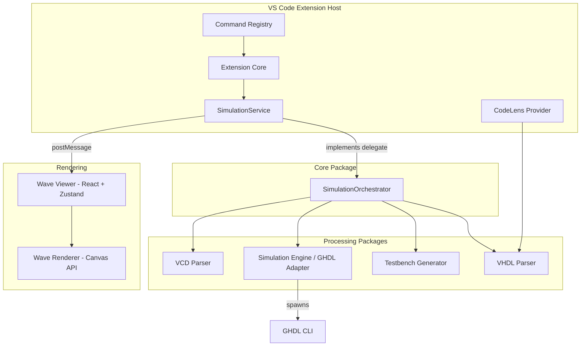

# Chronam — Architecture

> For the full architecture plan and roadmap, see [`architecture_and_plan.md`](../architecture_and_plan.md) in the project root.

## Overview

Chronam is a modern VHDL development environment delivered as a VS Code extension. It provides a unified flow: **write VHDL → press Run → see waveforms**.

## System Architecture

## Simulation Pipeline

The core simulation flow is:

1. **Parse** — Extract entities, ports, and generics from VHDL source
2. **Generate** — Create a testbench with clock/reset processes and DUT instantiation
3. **Compile** — Run `ghdl -a` on design + testbench files
4. **Elaborate** — Run `ghdl -e` on the testbench entity
5. **Simulate** — Run `ghdl -r` with `--vcd` flag to produce a waveform file
6. **Parse VCD** — Tokenize and parse the VCD output into structured signal data
7. **Render** — Send waveform data to the React webview for Canvas rendering

## Package Responsibilities

| Package | Responsibility |
|---|---|
| `shared-types` | TypeScript interfaces shared across all packages |
| `vhdl-parser` | Regex-based entity/port/architecture extraction |
| `testbench-generator` | Generates complete VHDL testbenches from parsed entities |
| `simulation-engine` | GHDL CLI adapter, process spawning, error translation |
| `vcd-parser` | Streaming VCD file tokenizer + parser |
| `wave-renderer` | Canvas-based waveform drawing engine |
| `wave-viewer` | React webview app with Zustand state management |
| `core` | Editor-agnostic orchestration via delegate pattern |
| `vscode-extension` | VS Code integration: commands, CodeLens, webview panels |

## Key Patterns

### Delegate Pattern (Core ↔ Extension)

The `SimulationOrchestrator` in `@chronam/core` defines an `OrchestratorDelegate` interface. The VS Code `SimulationService` implements this interface, providing:

- Status change notifications (for the status bar)
- Logging (to the output channel)
- Entity selection prompts (via QuickPick)
- Configuration retrieval (from VS Code settings)
- File reading (via Node.js `fs`)

This keeps the simulation pipeline testable and editor-agnostic.

### Webview Communication

The extension and wave viewer communicate via VS Code's `postMessage` API:

- **Extension → Webview:** `waveform:load`, `simulation:status`
- **Webview → Extension:** `ready`, `simulation:run`

Message types are defined in `@chronam/shared-types`.
